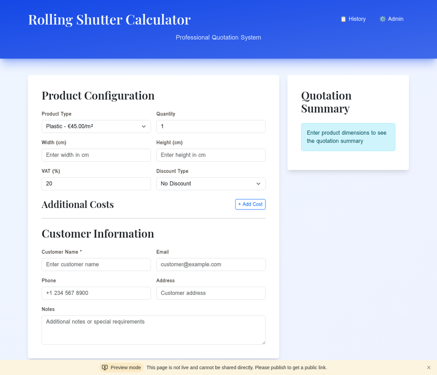
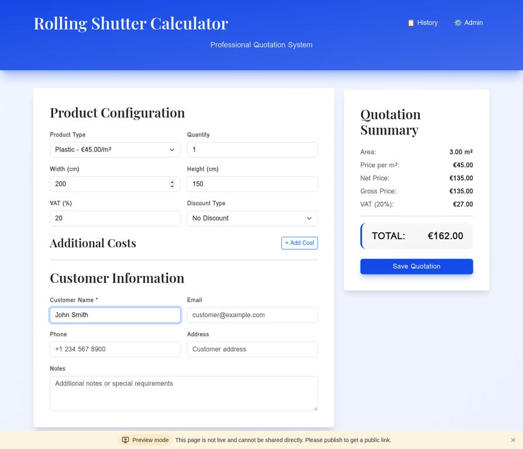
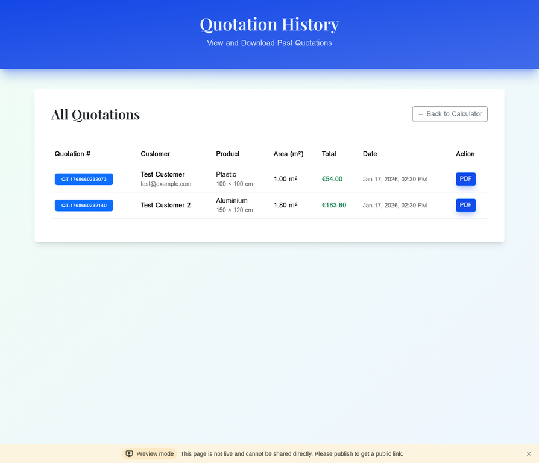
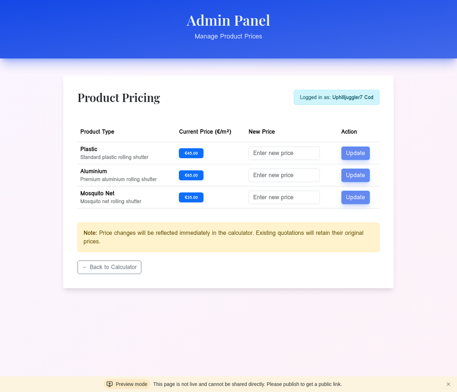

# Rolling Shutter Calculator - Application Screenshots

This document provides visual documentation of all main screens in the Rolling Shutter Price Calculator application.

---

## 1. Calculator Interface (Empty State)

**File:** `screenshot-calculator.png`

The main calculator interface showing the clean, elegant design with:
- Product configuration section (product type, quantity, dimensions)
- VAT and discount settings
- Additional costs section
- Customer information form
- Quotation summary panel (right side)

---

## 2. Calculator Interface (With Data)

**File:** `screenshot-calculator-filled.png`

The calculator with sample data entered, demonstrating:
- Width: 200 cm, Height: 150 cm
- Automatic area calculation: 3.00 m²
- Real-time price calculation
- Customer name: John Smith
- Live quotation summary showing:
  - Area: 3.00 m²
  - Price per m²: €45.00
  - Net Price: €135.00
  - Gross Price: €135.00
  - VAT (20%): €27.00
  - **TOTAL: €162.00**

---

## 3. Quotation History

**File:** `screenshot-history.png`

The quotation history page displaying:
- All saved quotations in a clean table format
- Quotation numbers (e.g., QT-1768660232073)
- Customer information
- Product type and dimensions
- Total area and price
- Date and time stamps
- PDF download buttons for each quotation
- Navigation back to calculator

Sample quotations shown:
- **Test Customer**: Plastic shutter, 1.00 m², €54.00
- **Test Customer 2**: Aluminium shutter, 1.80 m², €183.60

---

## 4. Admin Panel

**File:** `screenshot-admin.png`

The admin price management interface featuring:
- Secure authentication (showing logged-in user)
- Product pricing table with:
  - **Plastic**: €45.00/m² (Standard plastic rolling shutter)
  - **Aluminium**: €85.00/m² (Premium aluminium rolling shutter)
  - **Mosquito Net**: €35.00/m² (Mosquito net rolling shutter)
- Input fields for new prices
- Update buttons for each product
- Warning note about price change effects
- Navigation back to calculator

---

## Design Highlights

### Color Scheme
- **Header**: Elegant blue gradient (from blue-50 to indigo-50)
- **Cards**: Clean white with subtle shadows
- **Buttons**: Professional blue with hover effects
- **Summary Panel**: Light blue info box with clear typography

### Typography
- **Headings**: Playfair Display (elegant serif font)
- **Body**: System fonts for readability
- **Numbers**: Clear, bold formatting for prices

### Responsive Design
- Desktop-optimized layout shown
- Mobile-responsive grid system
- Bootstrap 5 components throughout
- Smooth animations and transitions

### User Experience
- Real-time calculations (no page refresh needed)
- Clear visual hierarchy
- Intuitive form layout
- Professional business appearance

---

## File Formats

All screenshots are available in two formats:
- **PNG**: High-quality, widely compatible (240-252 KB)
- **WebP**: Modern, compressed format (original captures)

---

## Usage

These screenshots can be used for:
- Project documentation
- Portfolio presentations
- User guides and tutorials
- Marketing materials
- Technical specifications
- Client demonstrations

---

*Screenshots captured on January 17, 2026*
*Application: Rolling Shutter Price Calculator v1.0*
